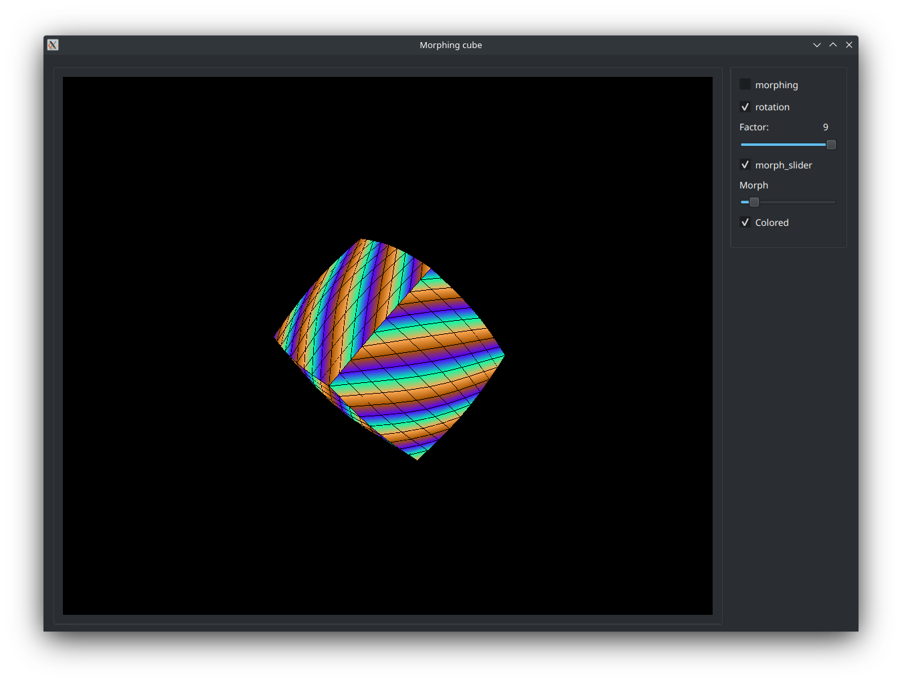
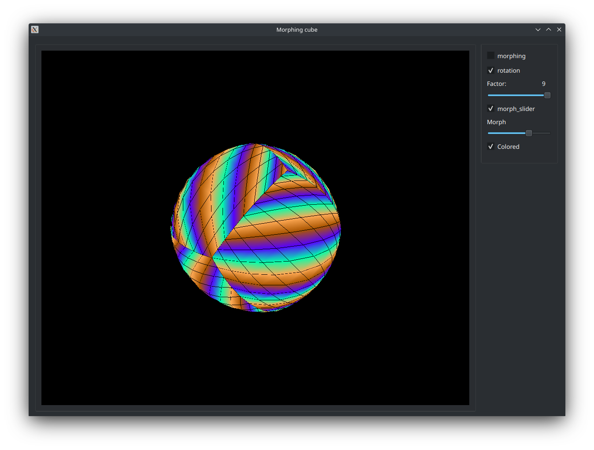
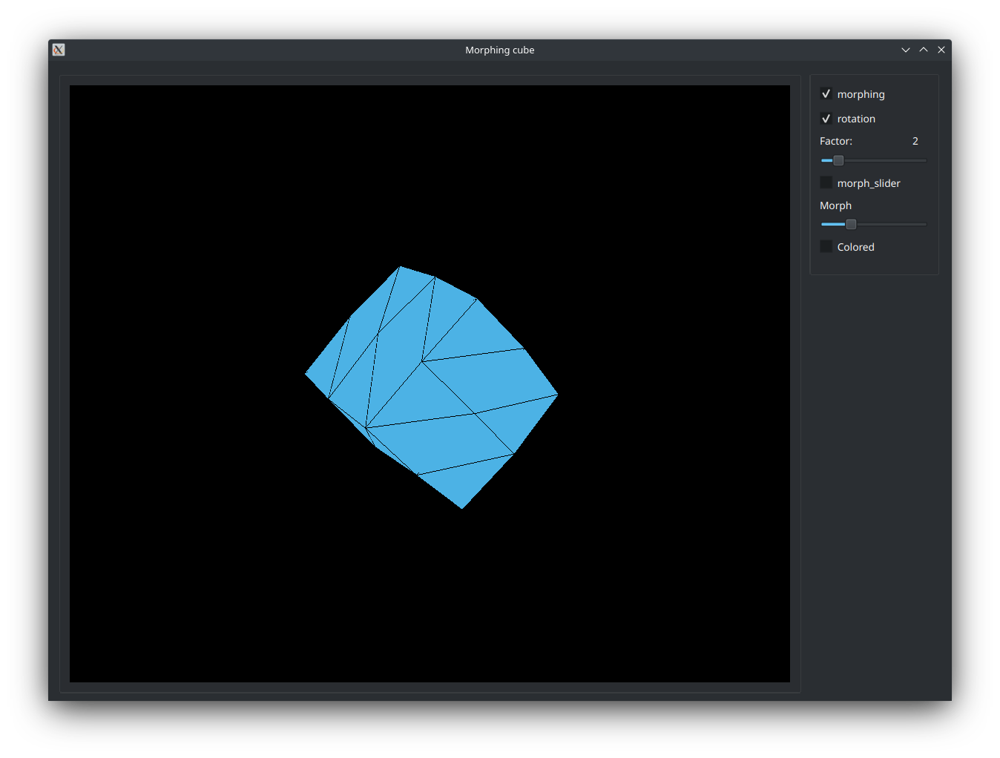
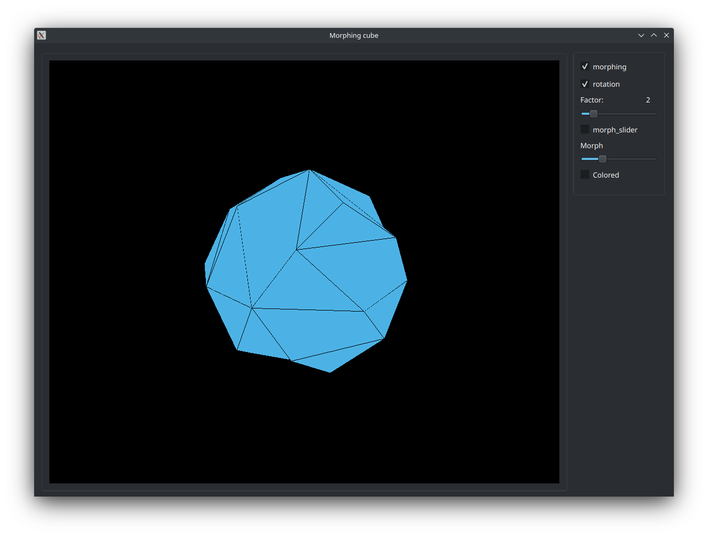

### Task 2
It's a cube that is morphing into sphere and back. You can turn off and on its color. You can turn off automorphing and morph it by yourself("Morph" slider). You can rotae it. You can change the number of polygons in this cube ("Factor" slider).

